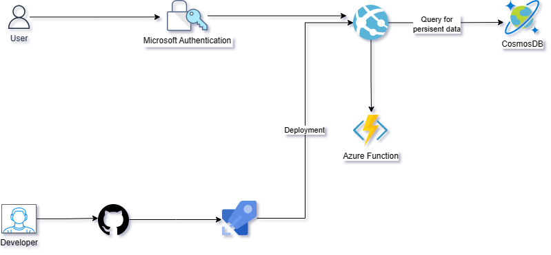

# Oceniaczka

Aplikacja do głosowania na aplikantów.

Funkcjonalności:
1. Logowanie z użyciem konta Microsoft.
2. Pobranie danych obecnego użytkownika.
3. Zagłosowanie.
4. Pobranie danych na temat głosowań.

Użyte technologie:
1. Azure WebApp.
2. Azure DevOps (pipeline z testami).
3. Azure Functions.
4. Azure AppInsights.
5. Autoryzacja.

